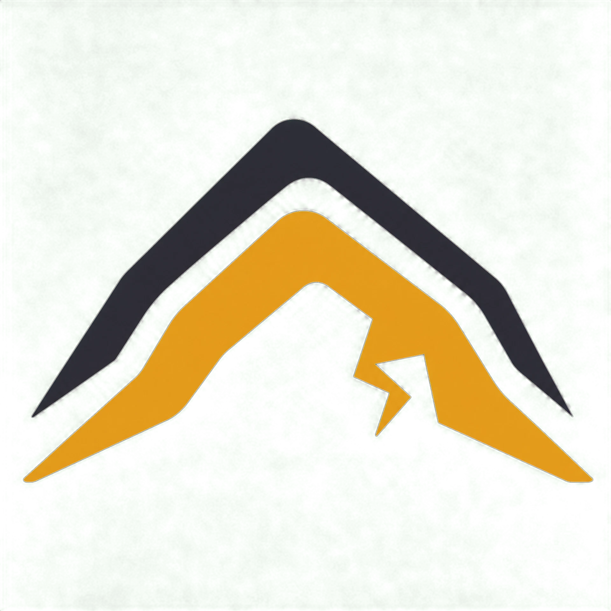

# LEWS — Landslide Early Warning System

<div align="center">



### **Hyperlocal Landslide Risk Monitoring & Decision Support Console**

[](LICENSE)
[](https://www.typescriptlang.org/)
[](https://react.dev/)
[](https://vitejs.dev/)
[](https://trpc.io/)
[](https://pnpm.io/)

> **Created by Jai Kishore G.V.**

</div>

---

## 📖 Overview

**LEWS (Landslide Early Warning System)** is a full-stack, responsive geological-monitoring dashboard prototype. Built for emergency planners, field researchers, and disaster-management teams, LEWS bridges the gap between broad regional meteorological forecasts and the hyperlocal slope conditions of vulnerable hillsides and villages.

The application follows the **"Surveyor's Field Console"** design philosophy — pairing mineral basalt surfaces, cartographic textures, and high-legibility telemetry to present an operational picture that is calm, accountable, and actionable.

---

## ⚡ Core Capabilities

- **🛰️ Live NASA EONET Event Ingestion**: Real-time integration with NASA's Earth Observatory Natural Event Tracker (v3), normalized, cached for 5 minutes, and displayed alongside simulated slope telemetry.
- **📊 Transparent 4-Factor Risk Engine**: Explainable 0–100 risk scoring combining Rainfall Intensity, Slope Tilt/Terrain, Historical Landslide Baseline, and Recent Reported Events.
- **🗺️ Interactive Geological Terrain Map**: Custom India mainland coordinate projection (8°N–36°N, 68°E–96°E) with monitored zone telemetry markers, EONET events, and click-to-analyze coordinates.
- **🌐 5-Language Alert Preview Engine**: Incident notification templates for English, Tamil (தமிழ்), Telugu (తెలుగు), Kannada (ಕನ್ನಡ), and Malayalam (മലയാളം).
- **🤖 Contextual AI Risk Intelligence**: Structured explanation layer that translates environmental signals into plain-language assessments, contributing factors, and safety protocols without hallucinating measurements.
- **📱 Citizen & Field Incident Queue**: Offline-ready citizen reporting workflow capturing slope cracks, rockfalls, blocked corridors, and photo attachments with geolocation.
- **⛈️ Controlled Storm Escalation Scenario**: Interactive demonstration mode to simulate weather deterioration, sensor threshold crossings, and critical alert transitions in real time.

---

## 📦 Package Manager: Why `pnpm`?

This project uses **`pnpm`** as its primary package manager:

1. **2x–3x Faster Installations & Disk Efficiency**: `pnpm` uses a global content-addressable store and hard links, preventing duplicate packages across projects.
2. **Native Patch Resolution**: The project relies on `patches/wouter@3.7.1.patch`, which `pnpm` natively resolves and applies out of the box (`"patchedDependencies"`).
3. **Clean Dependency Tree**: Eliminates phantom dependencies and avoids peer dependency resolution blockers common in modern React 19 + Vite 7 toolchains.

*(Instructions for both `pnpm` and `npm` are provided below).*

---

## 🚀 Step-by-Step Local Setup Guide

### Prerequisites (All Platforms)
- **Node.js**: `v20.x` or `v22.x` LTS (`v18+` minimum supported). Verify with `node -v`.
- **Git**: Installed and available in your PATH. Verify with `git --version`.

---

### 🐧 Linux (Ubuntu, Debian, Fedora, Arch)

```bash
# 1. Clone the repository
git clone https://github.com/Saravanan-Codez/HACKATHON-LEWS.git
cd HACKATHON-LEWS

# 2. Enable pnpm (via Corepack or npm)
corepack enable || npm install -g pnpm

# 3. Copy environment configuration
cp .env.example .env

# 4. Install dependencies
pnpm install

# 5. Start development server
pnpm dev
```

Open your browser at **`http://localhost:3000`**.

---

### 🍎 macOS (Apple Silicon / Intel)

```bash
# 1. Clone the repository
git clone https://github.com/Saravanan-Codez/HACKATHON-LEWS.git
cd HACKATHON-LEWS

# 2. Install pnpm (via Homebrew or Corepack)
brew install pnpm
# Alternatively: corepack enable && corepack prepare pnpm@10.4.1 --activate

# 3. Copy environment configuration
cp .env.example .env

# 4. Install dependencies
pnpm install

# 5. Start development server
pnpm dev
```

Open your browser at **`http://localhost:3000`**.

---

### 🪟 Windows (Native PowerShell & WSL2)

#### Option A: Windows PowerShell (Native)
```powershell
# 1. Clone the repository
git clone https://github.com/Saravanan-Codez/HACKATHON-LEWS.git
cd HACKATHON-LEWS

# 2. Enable Corepack / Install pnpm
npm install -g pnpm

# 3. Copy environment configuration
Copy-Item .env.example .env

# 4. Install dependencies
pnpm install
# (If using standard npm: npm install --legacy-peer-deps)

# 5. Start development server
pnpm dev
```

#### Option B: Windows Subsystem for Linux (WSL2 - Recommended)
Open your WSL terminal (Ubuntu) and execute the standard Linux steps above.

---

## 🛠️ Verification & Quality Assurance

Run the automated test suite and production build:

```bash
# 1. TypeScript compilation check
pnpm check

# 2. Run Vitest test suite (27 passing tests)
pnpm test

# 3. Production build (Vite frontend + esbuild server bundle)
pnpm build

# 4. Start production server
pnpm start
```

---

## 📁 Project Structure

| Directory / File | Description |
|---|---|
| `client/src/pages/Home.tsx` | Main Surveyor's Field Console dashboard & interactive controls |
| `client/src/index.css` | Design system (basalt surfaces, limestone type, custom map styling) |
| `client/src/lib/dataPresentation.ts` | Deterministic live, demo, empty, and fallback presentation states |
| `client/src/lib/notificationTranslations.ts` | Multilingual notification matrix (EN, TA, TE, KN, ML) |
| `client/src/lib/reportQueue.ts` | Local citizen report queue & offline persistence |
| `client/src/lib/aiAnalysisFlow.ts` | Risk category change detection for AI analysis refresh |
| `server/services/riskEngine.ts` | 4-factor deterministic risk scoring algorithm |
| `server/services/eonetService.ts` | NASA EONET live fetch, normalization, caching, and fallback |
| `server/services/aiRiskService.ts` | LLM risk intelligence explanation and assistant endpoints |
| `server/services/platformServices.ts` | Explicit capabilities boundary (honest unavailable states) |
| `server/routers.ts` | Type-safe tRPC procedure definitions |
| `docs/ARCHITECTURE.md` | System architecture, risk formulas, and data flow documentation |

---

## 🔍 Troubleshooting

| Issue | Resolution |
|---|---|
| **Port 3000 in use** | Set `PORT=3001` in your `.env` file or run `PORT=3001 pnpm dev`. |
| **`npm install` peer dependency error** | Run with `pnpm install` (recommended) or `npm install --legacy-peer-deps`. |
| **Pnpm command not found** | Run `npm install -g pnpm` or `corepack enable`. |
| **NASA EONET API timeout** | The server automatically serves a fail-safe fallback state without interrupting the console. |

---

## ⚖️ Important Limitations & Disclaimers

1. **NASA EONET Integration**: NASA EONET provides publicly reported natural-event data for regional context; it does not replace local rain gauges or official disaster-management bulletins.
2. **Prototype Risk Engine**: The 0–100 risk score and simulated sensor channels (Chikkamagaluru, Kodagu, Uttara Kannada, Wayanad, Nilgiris, Darjeeling) are for demonstration, research, and product development only.
3. **Official Authorities**: In an emergency, always follow instructions from the National Disaster Management Authority (NDMA), State Disaster Management Authorities (SDMA), and District Emergency Operation Centres (DEOC).

---

## 👤 Attribution & License

- **Created by**: **Jai Kishore G.V.**
- **License**: [MIT License](LICENSE)
