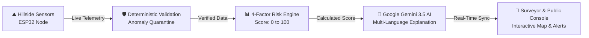

# 🏔️ 01. Executive Overview & Core Concepts

> **A Complete, Plain-English Guide to Landsora (LEWS)**  
> *Everything you need to understand how this system protects mountain communities, even if you have zero background in programming or geotechnical engineering.*

---

## 🌍 1. The Real-World Problem: What Are Landslides & Why Do They Happen?

A **landslide** is the sudden downward and outward movement of soil, mud, rocks, and debris down a slope. In mountainous regions across India—especially the **Western Ghats** (Wayanad, Kodagu, Nilgiris, Uttara Kannada) and the **Himalayas** (Darjeeling, Himachal Pradesh, Uttarakhand)—landslides cause severe loss of life, destroy infrastructure, and cut off vital transportation passes during every monsoon season.

```
       HEAVY MONSOON PRECIPITATION
                 🌧️ 🌧️ 🌧️
               ┌────────────────┐
               │ Topsoil Layer  │ ──► Soil absorbs water like a sponge; gets heavier
  TENSION      ├────────────────┤
  CRACKS ──► / │ Saturated Pore │ ──► Water pressure pushes soil grains apart (Loss of friction)
            /  ├────────────────┤
           /   │ Bedrock Layer  │ ──► Slippery boundary where catastrophic slope failure begins!
          ▼    └────────────────┘
```

### 🧽 The "Wet Sponge on a Slanted Cutting Board" Analogy
To understand why slopes collapse, imagine placing a dry kitchen sponge on a wooden cutting board tilted at an angle:
1. **When dry**: The sponge stays in place because the friction between the dry sponge and the board is high.
2. **When damp**: The sponge absorbs a bit of water, gets slightly heavier, but the friction still holds it up.
3. **When completely water-logged (Saturated)**: Water fills all the microscopic pores. The sponge becomes extremely heavy. Water builds up underneath the sponge (called **pore water pressure**), acting like a layer of liquid grease. Suddenly, the friction drops to near zero, and gravity drags the entire sponge sliding down the board!

This is exactly what happens on a mountain slope during heavy monsoon downpours. When the soil becomes supersaturated, the weight of the water combined with gravity overcomes the shear strength of the soil, causing a catastrophic hillside failure.

---

## 🚨 2. The Critical Gap in Existing Early Warning Systems

Today, disaster management authorities mostly rely on **regional weather forecasts** provided by meteorological satellites (e.g., *"Heavy rain expected over a 500 km² district"*).

However, broad weather forecasts suffer from three fatal flaws:
1. **Lack of Hyperlocal Ground Truth**: Rain might pour heavily in the valley, but the vulnerable ridge 2 kilometers away might be bone dry, or vice-versa.
2. **Zero Soil & Tilt Awareness**: A rain forecast cannot tell you if the slope's bedrock is already saturated or if the earth has begun tilting by fractions of a millimeter (micro-creep).
3. **Delayed Communication to Vulnerable Villages**: Alerts issued in English or state capitals often reach remote panchayats (village councils) hours after the road has already collapsed.

**Landsora solves this by placing low-cost, solar-powered IoT sensor nodes directly on vulnerable hillsides to detect real-time ground movement and saturation before catastrophic failure occurs.**(THIS FEATURE IS UNDER PROGRESS WAIT FOR THE FURTHER UPDATED)

---

## 🎯 3. What is Landsora (LEWS)?

**Landsora (Landslide Early Warning and Risk Monitoring System)** is an autonomous, full-stack decision-support platform that bridges the gap between regional meteorological data and hyperlocal hillside conditions.



---

## ⚖️ 4. The Core Safety Philosophy: Deterministic Math vs. AI

In disaster management, human life depends on absolute predictability and zero hallucinations. Landsora enforces a strict, non-negotiable principle:

> 🛡️ **Rule of Safety**: **Physical sensors, calibrated physics formulas, and deterministic rules compute the 0–100 risk score and safety level.**  
> 🤖 **Role of AI**: **Artificial Intelligence (Google Gemini 3.5 Flash) is strictly used to translate, synthesize, and explain the physical telemetry in plain human languages (Tamil, Telugu, Kannada, Malayalam, Hindi, English). The AI NEVER invents or modifies the risk calculation.**

| System Component | Who Decides? | How It Works | Why? |
|---|---|---|---|
| **Risk Score (0–100)** | **Deterministic Physics Formula** | Math equation combining rain, soil saturation, slope tilt, and historical baseline | 100% auditable, zero hallucination risk |
| **Data Validity** | **Deterministic Quarantine Engine** | 5 validation stages (e.g. Reject negative rain, isolate sudden >0.08° tilt shocks) | Prevents bird strikes or sensor bugs from creating false panic |
| **Risk Explanation** | **Google Gemini 3.5 Flash** | Reads the calculated risk score and sensor telemetry, generating plain-language guidance | Helps local officials understand complex geotechnical numbers |
| **Multi-Language Alerts** | **Pre-compiled Templates & Google Translate** | Pre-verified safety warnings translated into 5 regional Indian languages | Ensures zero latency and linguistic accuracy during power cuts |

---

## 👥 5. Dual-Audience Architecture: Public Citizen vs. Authority Command

During an environmental crisis, information needs to flow differently depending on who is looking at the screen:

```
                                  LANDSORA PLATFORM
                                          │
            ┌─────────────────────────────┴─────────────────────────────┐
            ▼                                                           ▼
     PUBLIC CITIZEN POV                                       AUTHORITY COMMAND POV
 (100% Free & Open Access)                              (Authenticated Role / Guest Demo)
            │                                                           │
   - Zero login required                                      - Role-verified login
   - Live color-coded risk gauges                             - Sensor baseline calibration
   - Mountain road corridor pass status                       - Multi-node hardware diagnostics
   - 5-language emergency advisories                          - 1-click critical siren broadcast
   - Crowd-sourced photo & crack report                       - Triage & sign-off citizen reports
```

### 👤 1. Public Citizen POV (Friction-Free Life Safety)
- **Zero Login Barrier**: Anyone walking on a mountain road or living in a valley village can open the URL on their mobile phone and immediately see the safety status of their hill.
- **Commute & Route Guidance**: Displays whether mountain passes (like NH 10 or Ghats roads) are open, restricted, or blocked.
- **Offline-Ready Ground Reporting**: Citizens can snap photos of fresh ground cracks or leaning trees and tag their GPS location, even if their mobile cellular connection is spotty.

### 🛡️ 2. Authority & Field Commander POV (Incident Management)
- **Role Verification**: Verified officials (District Disaster Management Authorities / DDMA, Geological Survey of India / GSI, Police) access administrative controls.
- **Multi-Node Sensor Registry**: Monitor battery voltages, solar charging rates, Wi-Fi/LoRa signal strength, and firmware health across dozens of remote nodes.
- **1-Click Siren & SMS Broadcast**: When an emergency threshold is reached, authorized officers can review the telemetry and trigger instant localized SMS alerts to village panchayats and push notifications to residents.
- **Citizen Report Triage**: Review citizen photo submissions to distinguish between genuine geological tension cracks and false rumors before dispatching emergency teams.

---

## 💡 6. Key Conceptual Glossary (No Jargon!)

| Term | What It Means in Simple English |
|---|---|
| **Telemetry** | Measurements (rain, soil moisture, tilt) gathered automatically by remote sensors and sent over the air to a central server.(STILL UNDER CONSTRUCTION ) |
| **Soil Moisture Saturation (%)** | How full of water the soil is. At 0%, it's dry sand. At 100%, it cannot absorb another drop and turns into liquid mud. |
| **Inclinometer / Tilt Rate (°/hr)** | A sensor that measures whether the ground is slowly leaning or sliding over time (even by 0.05 degrees per hour). |
| **Deterministic** | A process that will **always** produce the exact same output for a given input, with zero randomness or guessing. |
| **Quarantine Buffer** | A digital "holding pen" for sensor readings that look broken or physically impossible (e.g., rain gauge jumping by 500 mm in one second). Bad readings are isolated so they don't trigger false alarms. |
| **NASA EONET** | NASA's Earth Observatory Natural Event Tracker—a global live feed of earthquakes, storms, and natural disasters. |
| **Grounding (in AI)** | Forcing an AI model to base its answers strictly on verified real-world facts and search results rather than its own imagination. |
| **tRPC** | A technology that connects the website's front screen to the server with 100% automatic type safety, ensuring no data gets scrambled in transit. |
| **ESP32** | A tiny, low-cost computer chip ($4) equipped with built-in Wi-Fi and Bluetooth that connects to the sensors on the mountain.(STILL UNDER DEVELOPEMENT) |

---

## 🧭 Next Steps

Now that you have a solid conceptual understanding of Landsora:
- Proceed to [**02. Complete System Architecture**](./02_COMPLETE_SYSTEM_ARCHITECTURE.md) to see the technical diagrams and mathematics.
- Or explore [**03. File-by-File Exhaustive Reference**](./03_FILE_BY_FILE_EXHAUSTIVE_REFERENCE.md) to inspect every line of code across the project.
