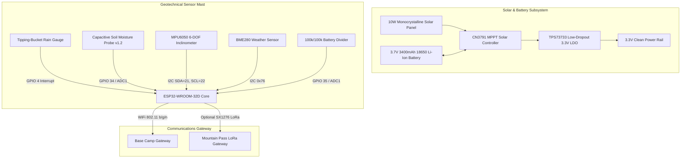

# 🔌 05. IoT Hardware & Embedded Systems Guide

> **Edge Microcontroller Pinouts, Sensor Schematics, Solar Power & ESP32 Firmware**  
> *A complete hardware handbook for electronic engineers, IoT developers, and field technicians.*

---

## 🗂️ Table of Contents

1. [Hardware Architecture Overview](#1-hardware-architecture-overview)
2. [Sensor Array & Technical Pinout](#2-sensor-array--technical-pinout)
3. [Power Budget & Solar MPPT Subsystem](#3-power-budget--solar-mppt-subsystem)
4. [Sensor Calibration Protocols](#4-sensor-calibration-protocols)
5. [ESP32 Firmware Architecture & Source Code](#5-esp32-firmware-architecture--source-code)

---

## 1. Hardware Architecture Overview

The Landsora field node is an autonomous, ultra-low-power edge monitoring station designed to survive hostile mountain conditions:



---

## 2. Sensor Array & Technical Pinout

| Sensor Component | Measured Parameter | Interface & Pin | Operating Voltage | Expected Range |
|---|---|---|---|---|
| **ESP32-WROOM-32D** | Dual Core 240MHz MCU | Core Controller | 3.3V | Active: 80mA, Deep Sleep: 15µA |
| **Tipping-Bucket Gauge** | Rainfall Intensity | `GPIO 4` (FALLING Interrupt) | 3.3V (Pull-up) | 0.0 to 150 mm/hr (0.2mm/tip) |
| **Capacitive Soil v1.2** | Volumetric Soil Moisture | `GPIO 34` (ADC1_CH6) | 3.3V | 0% (Air) to 100% (Water) |
| **MPU6050 / ICM-20948** | Angular Tilt Drift | `I2C` (SDA `GPIO 21`, SCL `GPIO 22`) | 3.3V | Pitch / Roll ($\pm45^\circ$) |
| **BME280** | Temp, Humidity, Pressure | `I2C` (Address `0x76`) | 3.3V | $-10^\circ\text{C}$ to $65^\circ\text{C}$, 0–100% RH |
| **Battery Divider** | Pack Voltage ($V_{\text{bat}}$) | `GPIO 35` (ADC1_CH7) | 3.0V to 4.2V | $100\text{k}\Omega / 100\text{k}\Omega$ ($2\times$ scaling) |

> ⚠️ **Critical ESP32 Note**: Always use **ADC1** pins (`GPIO 32 - 39`) for analog sensors when Wi-Fi is active. ADC2 channels are disabled internally by the ESP32 silicon whenever the Wi-Fi radio is transmitting!

---

## 3. Power Budget & Solar MPPT Subsystem

Mountain ridges often experience 5 to 10 days of continuous overcast rain during peak monsoon depressions. The power subsystem is sized for **14 days of zero sunlight autonomy**:

### ⚡ Power Budget Analysis

| Operating Mode | Duration per Cycle | Current Draw | Energy Consumption per Cycle |
|---|---|---|---|
| **Deep Sleep State** | 2.4 seconds | $15\,\mu\text{A}$ | $0.00001\text{ mAh}$ |
| **Sensor Sampling & I2C**| 0.05 seconds | $25\,\text{mA}$ | $0.00035\text{ mAh}$ |
| **Wi-Fi / Ingest TX** | 0.05 seconds | $140\,\text{mA}$ | $0.00194\text{ mAh}$ |
| **Total per 2.5s Cycle** | **2.5 seconds** | **Average: ~3.5 mA** | **~84 mAh per 24 hours** |

- **Battery Capacity**: Single 18650 Li-Ion Cell ($3.7\text{V}$, $3400\text{mAh}$).
- **Calculated Autonomy**: $\frac{3400\text{ mAh} \times 0.85\text{ efficiency}}{84\text{ mAh/day}} \approx \mathbf{34.4\text{ Days}}$ of continuous operation with zero solar charging.
- **Solar Harvesting**: A 10W panel generates $\sim 2000\text{ mAh}$ in just 2 hours of indirect daylight, recharging the battery pack rapidly.

---

## 4. Sensor Calibration Protocols

### 💧 1. Capacitive Soil Moisture Calibration (2-Point Method)
1. **Dry Air Reading ($ADC_{\text{dry}}$)**: Suspend the probe in room air. Record raw 12-bit ADC value (typically $\sim 3200$).
2. **Water Saturation Reading ($ADC_{\text{wet}}$)**: Submerge the sensor up to the white line in clean water. Record raw ADC value (typically $\sim 1400$).
3. **Linear Mapping Formula**:
   $$\text{Moisture (\%)} = \text{constrain}\left( \frac{ADC_{\text{dry}} - ADC_{\text{raw}}}{ADC_{\text{dry}} - ADC_{\text{wet}}} \times 100, 0, 100 \right)$$

### 📐 2. Inclinometer Tilt & Zero Calibration
1. Mount the ESP32 node securely onto the anchored geological steel borehole mast.
2. Allow 30 seconds for mechanical settling.
3. Compute the initial offset angles $\theta_{x0}$ and $\theta_{y0}$ from the accelerometer vector:
   $$\theta_x = \arctan\left( \frac{a_x}{\sqrt{a_y^2 + a_z^2}} \right) \times \frac{180}{\pi} - \theta_{x0}$$
4. Filter subsequent readings through an exponential moving average (EMA) to eliminate high-frequency wind vibration noise.

---

## 5. ESP32 Firmware Architecture & Source Code

The edge firmware (`firmware/esp32_landsora_node.ino`) runs on the ESP32 using the Arduino framework:

```cpp
/**
 * Landsora ESP32 Telemetry Node Firmware
 * Target: ESP32 Dev Module (WROOM-32D)
 * Libraries: ArduinoJson, Adafruit BME280, Adafruit MPU6050, WiFi, HTTPClient
 */

#include <WiFi.h>
#include <HTTPClient.h>
#include <Wire.h>
#include <Adafruit_Sensor.h>
#include <Adafruit_BME280.h>
#include <Adafruit_MPU6050.h>
#include <ArduinoJson.h>

// Wi-Fi & Ingest Configuration
const char* WIFI_SSID     = "MOUNTAIN_BASE_STATION";
const char* WIFI_PASSWORD = "secure_monsoon_key";
const char* INGEST_URL    = "http://192.168.1.100:3000/api/telemetry/ingest";
const char* NODE_ID       = "KDG-03";

// Hardware Pinouts
const int PIN_RAIN_PULSE  = 4;   // GPIO 4 (Tipping bucket interrupt)
const int PIN_SOIL_ADC    = 34;  // GPIO 34 (ADC1 Channel 6)
const int PIN_BATT_SENSE  = 35;  // GPIO 35 (100k/100k divider)

volatile unsigned long rainTipCount = 0;
unsigned long lastSampleTime = 0;

Adafruit_BME280 bme;
Adafruit_MPU6050 mpu;

void IRAM_ATTR onRainTip() {
  rainTipCount++;
}

void setup() {
  Serial.begin(115200);
  pinMode(PIN_RAIN_PULSE, INPUT_PULLUP);
  attachInterrupt(digitalPinToInterrupt(PIN_RAIN_PULSE), onRainTip, FALLING);

  Wire.begin(21, 22); // SDA=21, SCL=22
  bme.begin(0x76);
  mpu.begin();

  WiFi.begin(WIFI_SSID, WIFI_PASSWORD);
  Serial.println("[Landsora] Node Initialized");
}

void loop() {
  if (millis() - lastSampleTime >= 2500) { // 2.5s Telemetry Rate
    lastSampleTime = millis();

    // 1. Calculate Rain (0.2mm per tip)
    float rainMm = rainTipCount * 0.2;
    rainTipCount = 0;

    // 2. Read Soil Moisture
    int rawSoil = analogRead(PIN_SOIL_ADC);
    float soilPct = map(rawSoil, 3200, 1400, 0, 100);
    soilPct = constrain(soilPct, 0.0, 100.0);

    // 3. Read Inclinometer Tilt
    sensors_event_t a, g, temp;
    mpu.getEvent(&a, &g, &temp);
    float tiltDeg = abs(a.acceleration.x * 5.729); // Converted to degrees

    // 4. Read Battery Voltage
    float battVolts = (analogRead(PIN_BATT_SENSE) / 4095.0) * 3.3 * 2.0;

    // 5. Build JSON Payload
    StaticJsonDocument<512> doc;
    doc["nodeId"] = NODE_ID;
    doc["rainfallMm"] = rainMm;
    doc["soilMoisture"] = soilPct;
    doc["tiltDegrees"] = tiltDeg;
    doc["batteryVoltage"] = battVolts;
    doc["wifiRssiDbm"] = WiFi.RSSI();
    doc["temperatureC"] = bme.readTemperature();
    doc["humidity"] = bme.readHumidity();

    String jsonBuffer;
    serializeJson(doc, jsonBuffer);

    // 6. Transmit to Ingestion Gateway
    if (WiFi.status() == WL_CONNECTED) {
      HTTPClient http;
      http.begin(INGEST_URL);
      http.addHeader("Content-Type", "application/json");
      int httpCode = http.POST(jsonBuffer);
      Serial.printf("[Ingest] Response: %d\n", httpCode);
      http.end();
    }
  }
}
```
