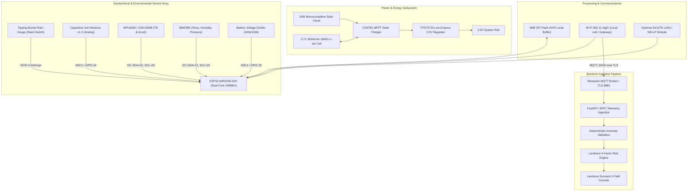

# Landsora — IoT Hardware, Firmware & Telemetry Protocol Specification

This document details the hardware architecture, sensor pinout, telemetry contracts, and PlatformIO starter implementation for **Landsora field sensor nodes**.

---

## 1. Hardware Architecture Diagram



---

## 2. Sensor-to-Metric Mapping Table

| Sensor | Metric Name | Physical Unit | Sampling Interval | Expected Range | Validation Limits | Notes |
|---|---|---|---|---|---|---|
| **Tipping Bucket** | `rainfall_mm_interval` | `mm/interval` | 2.5s buffer (pulse counter) | 0.0 – 35.0 mm | `0.0 <= x <= 150.0` | 0.2mm per tip calibration |
| **Capacitive v1.2** | `soil_moisture_percent` | `%` volumetric | 2.5s | 15.0% – 95.0% | `0.0 <= x <= 100.0` | 2-point air/water calibration |
| **MPU6050 / ICM-20948** | `tilt_degrees` | `degrees (°)` | 2.5s | 0.010° – 0.150° | `-45.0 <= x <= 45.0` | Inclinometer filtered pitch/roll |
| **BME280** | `temperature_c` | `°C` | 10s | 5.0°C – 45.0°C | `-10.0 <= x <= 65.0` | Ambient temperature |
| **BME280** | `humidity_percent` | `%` RH | 10s | 20.0% – 100.0% | `0.0 <= x <= 100.0` | Atmospheric humidity |
| **BME280** | `pressure_hpa` | `hPa` | 10s | 850.0 – 1025.0 hPa | `700.0 <= x <= 1100.0` | Barometric pressure trend |
| **Voltage Divider** | `battery_voltage` | `Volts (V)` | 30s | 3.5V – 4.2V | `3.0V <= x <= 4.3V` | 100kΩ/100kΩ resistor bridge |

---

## 3. MQTT Topic Hierarchy & Payload Contract

### Topic Conventions
- **Telemetry**: `landsora/v1/{site_id}/{device_id}/telemetry`
- **Device Health**: `landsora/v1/{site_id}/{device_id}/health`
- **Device Configuration**: `landsora/v1/{site_id}/{device_id}/config`
- **Command Acknowledgment**: `landsora/v1/{site_id}/{device_id}/ack`

### Versioned Telemetry Payload Schema (`v1.0`)
```json
{
  "schema_version": "1.0",
  "message_id": "9b1deb4d-3b7d-4bad-9bdd-2b0d7b3dcb6d",
  "sequence_number": 4182,
  "site_id": "KDG-03",
  "device_id": "landsora-esp32-001",
  "captured_at_utc": "2026-09-01T07:30:00.000Z",
  "sent_at_utc": "2026-09-01T07:30:00.250Z",
  "source_mode": "LIVE",
  "sensors": {
    "rainfall_mm_interval": 18.4,
    "rainfall_mm_24h": 68.2,
    "soil_moisture_percent": 78.2,
    "tilt_x_degrees": 0.084,
    "tilt_y_degrees": 0.042,
    "acceleration_mps2": 0.012,
    "temperature_c": 21.4,
    "humidity_percent": 86.5,
    "pressure_hpa": 1008.4
  },
  "device_health": {
    "battery_voltage": 3.92,
    "battery_percent": 84,
    "wifi_rssi_dbm": -64,
    "free_heap_bytes": 184520,
    "uptime_seconds": 86420,
    "firmware_version": "1.0.0",
    "sensor_fault_flags": []
  },
  "calibration": {
    "soil_moisture_calibrated": true,
    "tilt_calibrated": true
  }
}
```

---

## 4. PlatformIO Starter Firmware (Arduino C++)

```cpp
/**
 * Landsora ESP32 Telemetry Node Firmware Starter
 * Target: ESP32 Dev Module / PlatformIO
 * Dependencies: PubSubClient, Adafruit BME280, Adafruit MPU6050, ArduinoJson
 */

#include <WiFi.h>
#include <PubSubClient.h>
#include <Wire.h>
#include <Adafruit_Sensor.h>
#include <Adafruit_BME280.h>
#include <Adafruit_MPU6050.h>
#include <ArduinoJson.h>

// Wi-Fi & MQTT Configurations
const char* WIFI_SSID = "YOUR_WIFI_SSID";
const char* WIFI_PASS = "YOUR_WIFI_PASSWORD";
const char* MQTT_SERVER = "192.168.1.100"; // Or cloud broker endpoint
const int MQTT_PORT = 1883;
const char* SITE_ID = "KDG-03";
const char* DEVICE_ID = "landsora-esp32-001";

// Pin Assignments
const int PIN_RAIN_PULSE = 4;
const int PIN_SOIL_ANALOG = 34;
const int PIN_BATT_SENSE = 35;

WiFiClient espClient;
PubSubClient mqttClient(espClient);
Adafruit_BME280 bme;
Adafruit_MPU6050 mpu;

volatile unsigned long rainTips = 0;
unsigned long lastPublish = 0;
uint32_t sequenceNumber = 0;

void IRAM_ATTR onRainTip() {
  rainTips++;
}

void setup() {
  Serial.begin(115200);
  pinMode(PIN_RAIN_PULSE, INPUT_PULLUP);
  attachInterrupt(digitalPinToInterrupt(PIN_RAIN_PULSE), onRainTip, FALLING);

  Wire.begin(21, 22);
  bme.begin(0x76);
  mpu.begin();

  WiFi.begin(WIFI_SSID, WIFI_PASS);
  mqttClient.setServer(MQTT_SERVER, MQTT_PORT);
}

void loop() {
  if (!mqttClient.connected()) {
    // Reconnect logic with exponential backoff
  }
  mqttClient.loop();

  if (millis() - lastPublish >= 2500) { // 2.5s Telemetry Interval
    lastPublish = millis();
    sequenceNumber++;

    sensors_event_t a, g, temp;
    mpu.getEvent(&a, &g, &temp);

    float rainMm = rainTips * 0.2;
    rainTips = 0; // Reset interval counter

    int rawSoil = analogRead(PIN_SOIL_ANALOG);
    float soilPct = map(rawSoil, 3200, 1400, 0, 100);
    soilPct = constrain(soilPct, 0.0, 100.0);

    float battVolts = (analogRead(PIN_BATT_SENSE) / 4095.0) * 3.3 * 2.0;

    StaticJsonDocument<768> doc;
    doc["schema_version"] = "1.0";
    doc["sequence_number"] = sequenceNumber;
    doc["site_id"] = SITE_ID;
    doc["device_id"] = DEVICE_ID;
    doc["source_mode"] = "LIVE";

    JsonObject sensors = doc.createNestedObject("sensors");
    sensors["rainfall_mm_interval"] = rainMm;
    sensors["soil_moisture_percent"] = soilPct;
    sensors["tilt_x_degrees"] = a.acceleration.x * 5.729;
    sensors["temperature_c"] = bme.readTemperature();
    sensors["humidity_percent"] = bme.readHumidity();
    sensors["pressure_hpa"] = bme.readPressure() / 100.0F;

    JsonObject health = doc.createNestedObject("device_health");
    health["battery_voltage"] = battVolts;
    health["wifi_rssi_dbm"] = WiFi.RSSI();
    health["free_heap_bytes"] = ESP.getFreeHeap();
    health["uptime_seconds"] = millis() / 1000;
    health["firmware_version"] = "1.0.0";

    char buffer[768];
    serializeJson(doc, buffer);
    mqttClient.publish("landsora/v1/KDG-03/landsora-esp32-001/telemetry", buffer);
  }
}
```
