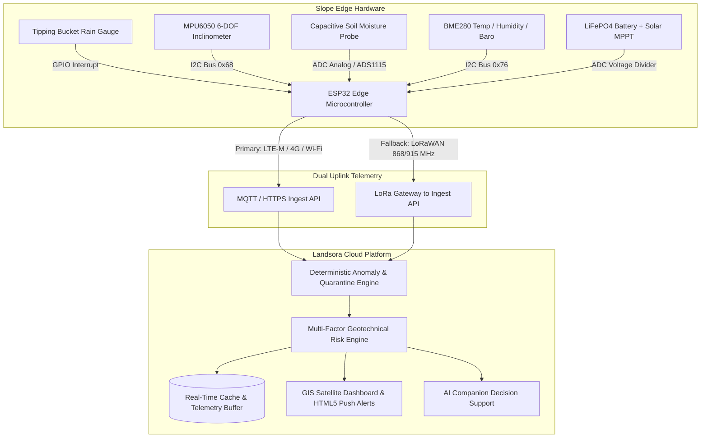

# Landsora Landslide Early Warning System (LEWS) — Hardware & Firmware Hub

Welcome to the **Landsora Geotechnical IoT & Edge Sensor Engineering** documentation hub. This directory contains the complete production-grade hardware schematics, calibration protocols, communication specifications, and ESP32 microcontroller firmware for real-world slope stability monitoring.

---

## 🗂️ Directory Structure

```
/landslide/
├── README.md                           # Master engineering index (this file)
├── architecture/
│   ├── SYSTEM_ARCHITECTURE.md          # Full-system data pipeline & Mermaid diagrams
│   └── COMMUNICATION_PROTOCOL.md       # JSON schemas, MQTT topics & LoRaWAN specs
├── hardware/
│   ├── HARDWARE_SPECIFICATION.md       # Bill of Materials (BOM) & power budget
│   ├── WIRING_DIAGRAM.md               # Electrical wiring & pinout diagrams
│   └── CALIBRATION_GUIDE.md            # Soil moisture, tilt & rain calibration
└── firmware/
    ├── README.md                       # Firmware compilation & flashing guide
    └── esp32_lews_node/
        ├── config.h                    # Pinouts, thresholds & credentials
        └── esp32_lews_node.ino         # Full ESP32 C++ firmware (FreeRTOS & Deep Sleep)
```

---

## 🏔️ System Overview

The Landsora LEWS field node is an autonomous, solar-powered edge telemetry device engineered for deployment across high-risk mountain escarpments (such as the Western Ghats and Himalayas).



---

## ⚡ Key Engineering Highlights

1. **Ultra-Low Power Deep Sleep Architecture**: Operates continuously for 14+ days of zero solar radiation using power cycling and hardware interrupt wakeups.
2. **Dual-Uplink Redundancy**: Automatic failover between Cellular 4G/LTE (HTTPS/MQTT) and long-range LoRaWAN (865–867 MHz in India / 915 MHz).
3. **Hardware Anomaly Quarantine**: Edge noise detection filters out single-point accelerometer vibration spikes (e.g., passing trucks, wildlife) from genuine slope failure tilt drift.
4. **Local Flash Offline Cache**: When cellular or network links are disrupted, up to 10,000 readings are stored on local SPIFFS Flash memory and burst-synchronized upon link restoration.
