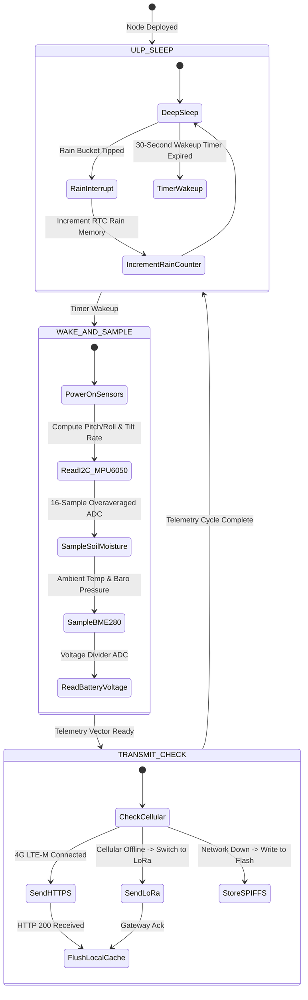
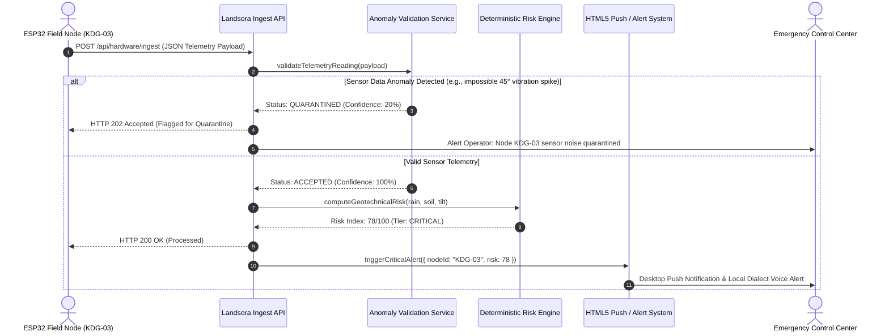
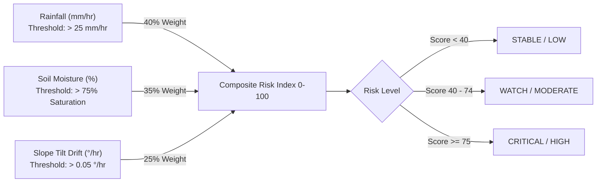

# Landsora LEWS — System Architecture & Data Pipeline

This document details the end-to-end architecture of the **Landsora Landslide Early Warning System**, from physical geotechnical sensors deployed in high-relief mountain terrains to cloud-native risk computation and emergency alerts.

---

## 1. End-to-End System Architecture

```mermaid
flowchart TB
    subgraph "1. Mountain Field Node (ESP32 Edge)"
        direction TB
        S1["Tipping Bucket Rain Gauge<br/>(0.2 mm resolution)"]
        S2["MPU6050 6-DOF IMU<br/>(Slope Inclination & Tilt Rate)"]
        S3["Capacitive Soil Probe v1.2<br/>(Volumetric Water Content %)"]
        S4["BME280 Environmental<br/>(Temp, Humidity, Barometric Press)"]
        BAT["3.7V 3200mAh LiFePO4 Battery<br/>+ 6W Solar Panel / MPPT"]

        S1 -->|Hardware Pulse Interrupt Pin 33| MCU["ESP32 Dual-Core Microcontroller<br/>(FreeRTOS + Deep Sleep Manager)"]
        S2 -->|I2C SDA:21, SCL:22| MCU
        S3 -->|ADC1 CH6 Pin 34 (Analog)| MCU
        S4 -->|I2C 0x76| MCU
        BAT -->|ADC1 CH7 Pin 35 (Divider)| MCU
    end

    subgraph "2. Field Telemetry Uplink"
        MCU -->|Primary Telemetry: JSON over HTTPS / MQTT| 4G["SIM7600 4G LTE-M Cellular / Wi-Fi"]
        MCU -->|Secondary Telemetry: Binary Payload| LORA["SX1262 LoRa 865-867 MHz Gateway"]
        4G --> CLOUD_INGEST["Landsora Ingest API Endpoint<br/>(POST /api/hardware/ingest)"]
        LORA --> CLOUD_INGEST
    end

    subgraph "3. Deterministic Anomaly & Validation Layer"
        CLOUD_INGEST --> ANOM["Physical Constraint Validator<br/>(anomalyValidationService.ts)"]
        ANOM -->|Spike / Noise Detected| QUAR["Quarantine Buffer<br/>(Marked for Operator Review)"]
        ANOM -->|Valid Geotechnical Reading| RISK_ENGINE["Multi-Factor Landslide Risk Engine<br/>(riskEngine.ts)"]
    end

    subgraph "4. Cloud Intelligence & Presentation"
        RISK_ENGINE --> BUFFER["Live Telemetry Buffer<br/>(liveNodesBuffer Map)"]
        RISK_ENGINE -->|Composite Risk >= 75 / Critical| NOTIF["Native HTML5 Desktop Push Alert<br/>+ Local Dialect Toast (KN/TA/ML/HI)"]
        BUFFER --> GIS["Interactive Satellite & Topographic Map<br/>(Leaflet GIS Engine)"]
        BUFFER --> AI["AI Companion Decision Engine<br/>(Gemini Multi-Turn + Google Grounding)"]
    end
```

---

## 2. Edge Microcontroller State Machine

The ESP32 firmware utilizes FreeRTOS and ESP32 RTC timers to maximize power longevity on mountain batteries:



---

## 3. Telemetry Transmission Sequence Diagram



---

## 4. Multi-Factor Risk Assessment Algorithm

The Landsora cloud risk computation combines real-time physical parameters with weighted geotechnical coefficients:

$$	ext{Risk Index} = (w_r \cdot S_{	ext{rain}}) + (w_s \cdot S_{	ext{soil}}) + (w_t \cdot S_{	ext{tilt}})$$

Where:
- $w_r = 0.40$ (Precipitation intensity weight)
- $w_s = 0.35$ (Capacitive soil moisture saturation weight)
- $w_t = 0.25$ (Inclinometer angular tilt rate weight)


