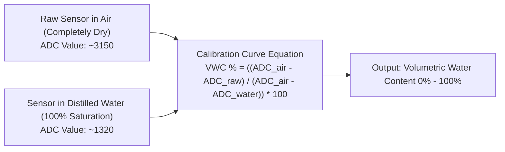

# Landsora LEWS — Field Sensor Calibration Protocols

Accurate landslide risk prediction requires precise physical calibration of capacitive soil probes, inclinometer zero-points, and rain gauge tip volumes. Follow this step-by-step procedure prior to slope installation.

---

## 1. Capacitive Soil Moisture Calibration (VWC %)

Capacitive soil sensors measure dielectric permittivity rather than electrical resistance, preventing galvanic corrosion over years in wet soil.

### Calibration Steps
1. **Air Calibration ($ADC_{	ext{air}}$)**: Hold the dry probe in ambient air. Record the average ADC reading ($ADC_{	ext{air}} pprox 3150$).
2. **Water Calibration ($ADC_{	ext{water}}$)**: Submerge the probe up to the marked line in water. Record the average ADC reading ($ADC_{	ext{water}} pprox 1320$).
3. **Soil Matrix Formula**:
   $$	ext{Moisture (\%)} = 	ext{constrain}\left(rac{ADC_{	ext{air}} - ADC_{	ext{raw}}}{ADC_{	ext{air}} - ADC_{	ext{water}}} 	imes 100,\ 0,\ 100
ight)$$

---

## 2. Inclinometer Zero-Offset & Slope Drift ($^\circ/	ext{hr}$)

To distinguish structural ground movement from constant hillslope angle:

1. **Mounting Baseline**: Once the IP67 enclosure is bolted to the slope steel anchor, power on the node and wait 60 seconds for temperature stabilization.
2. **Baseline Calibration**: The ESP32 averages 500 samples of accelerometer angles:
   $$	heta_{	ext{pitch}} = rctan2(A_y, \sqrt{A_x^2 + A_z^2}) 	imes rac{180}{\pi}$$
   $$	heta_{	ext{roll}} = rctan2(-A_x, A_z) 	imes rac{180}{\pi}$$
3. **Baseline Zeroing**: Store $	heta_{	ext{pitch\_zero}}$ and $	heta_{	ext{roll\_zero}}$ in Non-Volatile Storage (NVS Flash).
4. **Displacement Rate**: Real-time tilt displacement rate is measured as:
   $$\Delta	heta = \sqrt{(	heta_{	ext{pitch}} - 	heta_{	ext{pitch\_zero}})^2 + (	heta_{	ext{roll}} - 	heta_{	ext{roll\_zero}})^2}$$

---

## 3. Rain Gauge Tipping Bucket Calibration

1. **Funnel Area**: Landsora uses standard 200 mm diameter funnels ($A = 314.16\ 	ext{cm}^2$).
2. **Bucket Tip Volume**: Each physical tip equals $6.28\ 	ext{mL}$ of water.
3. **Precipitation Resolution**:
   $$	ext{Rain per Tip} = rac{6.28\ 	ext{cm}^3}{314.16\ 	ext{cm}^2} = 0.02\ 	ext{cm} = \mathbf{0.2\ 	ext{mm}}$$
