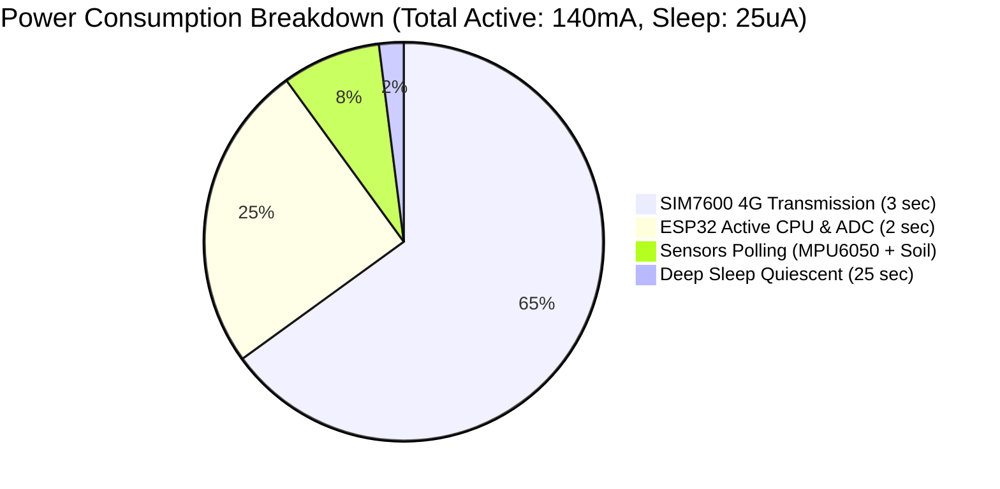
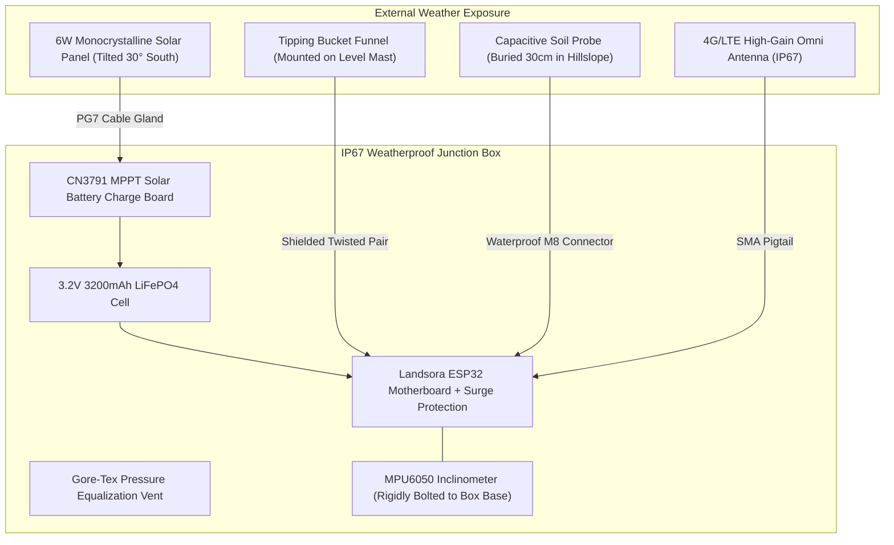

# Landsora LEWS — Hardware Specification & Bill of Materials (BOM)

This document outlines the physical hardware components, power budget calculations, environmental enclosures, and mechanical anchoring required to deploy a production-grade **Landsora Landslide Early Warning Node** on high-risk mountain slopes.

---

## 1. Bill of Materials (BOM)

| Component | Part / Model | Purpose | Interface | Voltage | Approx Cost (USD) |
| :--- | :--- | :--- | :--- | :--- | :--- |
| **Main MCU** | ESP32-WROOM-32E (4MB Flash) | Edge computation, FreeRTOS, deep sleep & sensor polling | Dual Core 240MHz | 3.3V | \$4.50 |
| **Inclinometer** | MPU6050 (or BNO055 9-DOF) | Slope tilt angle, acceleration & micro-displacement rate | I2C (0x68) | 3.3V | \$2.80 |
| **Soil Moisture** | Capacitive Soil Moisture v1.2 / Chirp | Volumetric water content & pore saturation (corrosion resistant) | Analog ADC | 3.3V | \$3.20 |
| **Rain Gauge** | Tipping Bucket (0.2 mm/tip) | Precipitation accumulation and instantaneous rain rate | Digital Interrupt | 3.3V / 5V | \$18.00 |
| **Environment** | BME280 | Barometric pressure, ambient temp, relative humidity | I2C (0x76) | 3.3V | \$3.50 |
| **Cellular Modem** | Waveshare SIM7600G-H 4G/LTE-M | Primary long-range cloud telemetry uplink (HTTPS/MQTT) | UART / USB | 3.8V - 4.2V | \$32.00 |
| **LoRa Backup** | Semtech SX1262 LoRa HAT (868MHz) | Redundant secondary mountain link (mesh / gateway) | SPI | 3.3V | \$12.00 |
| **Battery** | LiFePO4 3.2V 3200mAh (18650/26650) | High cycle-life, wide temperature range (-20°C to 65°C) | Direct Power | 3.2V - 3.6V | \$8.00 |
| **Solar Panel** | 6W 6V Monocrystalline Panel | Autonomous off-grid solar harvesting | Solar Input | 6.0V Voc | \$14.00 |
| **Solar Charger** | CN3791 MPPT Solar Charger Board | Maximum power point tracking for single-cell LiFePO4 | MPPT Controller | 3.6V Float | \$4.50 |
| **Enclosure** | IP67 Polycarbonate Weatherproof Box | Dustproof, water immersion resistant, UV stabilized | Mechanical | — | \$15.00 |
| **Total Node Cost** | | | | | **~\$117.50** |

---

## 2. Power Budget Analysis

### Power Calculations
- **Deep Sleep Current**: $25\ \mu	ext{A}$ (ULP and RTC memory active)
- **Active Sensing Current**: $35\ 	ext{mA}$ for $2\ 	ext{seconds}$
- **Cellular Transmission Current**: $180\ 	ext{mA}$ peak for $3\ 	ext{seconds}$
- **Average Hourly Consumption**:
  $$I_{	ext{avg}} = rac{(25\ \mu	ext{A} 	imes 3540	ext{s}) + (35\ 	ext{mA} 	imes 24	ext{s}) + (180\ 	ext{mA} 	imes 36	ext{s})}{3600	ext{s}} pprox 2.05\ 	ext{mA}$$
- **Battery Autonomy**:
  $$	ext{Days without Sun} = rac{3200\ 	ext{mAh} 	imes 0.85}{2.05\ 	ext{mA} 	imes 24\ 	ext{hr/day}} pprox \mathbf{55\ 	ext{Days}}$$

---

## 3. Mechanical & Enclosure Architecture

